# 微服务学习
SpringCloud和SpringCloudAlibaba微服务分布式架构学习

---
## eureka

### 注册中心（eureka-server7001）
#### maven依赖
```xml
<dependency>
    <groupId>org.springframework.cloud</groupId>
    <artifactId>spring-cloud-starter-netflix-eureka-client</artifactId>
</dependency>
```

##### yml配置
```yaml
spring:
  application:
    name: eureka-server7001

eureka:
  instance:
    hostname: localhost
  client:
    register-with-eureka: false
    fetch-registry: false
    service-url:
      defaultZone: http://${eureka.instance.hostname}:${server.port}/eureka/
```

#### 启动类注解
```java
//@EnableEurekaServer
```

### 客户端
#### maven依赖
```xml
<dependency>
    <groupId>org.springframework.cloud</groupId>
    <artifactId>spring-cloud-starter-netflix-eureka-client</artifactId>
</dependency>
```

#### yml配置
```yaml
eureka:
  instance:
    hostname: localhost
  client:
    register-with-eureka: false
    fetch-registry: false
    service-url:
      defaultZone: http://localhost:7001/eureka
```
#### 启动类注解
```java
//@EnableEurekaClient
```

---

### eureka的自我保护机制

Eureka服务端会检查最近15分钟内所有Eureka 实例正常心跳占比，如果低于85%就会触发自我保护机制。触发了保护机制，Eureka将暂时把这些失效的服务保护起来，不让其过期，但这些服务也并不是永远不会过期。Eureka在启动完成后，每隔60秒会检查一次服务健康状态，如果这些被保护起来失效的服务过一段时间后（默认90秒）还是没有恢复，就会把这些服务剔除。如果在此期间服务恢复了并且实例心跳占比高于85%时，就会自动关闭自我保护机制。

### 禁止自我保护
```yaml
eureka:
  server:
    enable-self-preservation: false
    eviction-interval-timer-in-ms: 2000
```

## spring-cloud-zookeeper

### maven依赖
```xml
<dependency>
    <groupId>org.springframework.cloud</groupId>
    <artifactId>spring-cloud-starter-zookeeper-discovery</artifactId>
</dependency>
```
### yml配置
```yaml
spring:
  application:
    name: zookeeper-provider-payment
  cloud:
    zookeeper:
      connect-string: 192.168.159.135:2181
```

### 启动类注解
```java
//@EnableDiscoveryClient
```

---

## spring-cloud-consul

### 下载安装地址
https://developer.hashicorp.com/consul/downloads

### 启动命令
consul agent -dev

### maven依赖
```xml
<dependency>
    <groupId>org.springframework.cloud</groupId>
    <artifactId>spring-cloud-starter-consul-discovery</artifactId>
</dependency>
```

### yml配置

```yaml
spring:
  application:
    name: consul-provider-payment
  cloud:
    consul:
      host: localhost
      port: 8500
```

## eureka、zookeeper、consul三个注册中心的异同点


---

## OpenFeign

### maven依赖
```xml
<dependency>
    <groupId>org.springframework.cloud</groupId>
    <artifactId>spring-cloud-starter-openfeign</artifactId>
</dependency>
```

### 客户端申明
```java
@FeignClient(value = "eureka-provider-payment")
public interface PaymentFeignService {

    @GetMapping("/payment/queryById/{id}")
    CommonResult<Payment> queryById(@PathVariable Integer id);

    @PostMapping("/payment/insert")
    CommonResult<Integer> insert(@RequestBody Payment payment);
}
```

### 启动类开启OpenFeign注解
```java
//@EnableFeignClients
```

### 超时控制
```yaml
#第一种方式直接使用底层的ribbon来控制超时
#ribbon:
#  ReadTimeout: 5000
#  ConnectTimeout: 5000

# 第二种使用feign的配置来实现
feign:
  client:
    config:
      # 默认配置，对所有的客户端都有作用
      default:
        connectTimeout: 5000
        readTimeout: 5000
      # 对单独的服务进行配置，优先级大于默认配置，也既是调用eureka-provider-payment时候，会使用单独配置
      eureka-provider-payment:
        connectTimeout: 2000
        readTimeout: 2000
```

### 日志使用
和上述超时配置一样是在FeignClientProperties中
```yaml
feign:
  client:
    config:
      # 默认配置，对所有的客户端都有作用
      default:
        connect-timeout: 5000
        read-timeout: 5000
        logger-level: FULL
      # 对单独的服务进行配置，优先级大于默认配置，也既是调用eureka-provider-payment时候，会使用单独配置
#      eureka-provider-payment:
#        connect-timeout: 2000
#        read-timeout: 2000
logging:
  level:
    com.fengfan.springcloud: debug
```
因为 OpenFeign 的调试日志是以 debug 级别来输出的。而 Spring Boot 默认的日志级别是 info 级别。info 级别是大于 debug 级别的，所以 debug 级别的日志（OpenFeign日志）不会输出。我们需要把我们项目日志改成debug。

---

## Hystrix

### 概述


### 重要概念

1. 服务降级： 服务器忙，请稍候再试，不让客户端等待并立刻返回一个友好提示，fallback。
哪些情况会触发降级：程序运行异常、超时、服务熔断触发服务降级、线程池/信号量打满也会导致服务降级

2. 服务熔断：类比保险丝达到最大服务访问后，直接拒绝访问，拉闸限电，然后调用服务降级的方法并返回友好提示。整个过程：服务的降级->进而熔断->恢复调用链路

3. 服务限流：秒杀高并发等操作，严禁一窝蜂的过来拥挤，大家排队，一秒钟N个，有序进行

### 服务降级

@HystrixCommand实现服务端服务降级

feign客户端降级：
```yaml
feign:
  hystrix:
    enabled: true
```

启动类：
```java
//@EnableHystrix
```

业务类：
```java
@FeignClient(value = "hystrix-provider-payment", fallback = HystrixFeignFallbackImpl.class)
public interface HystrixFeignConsumerService {

    @GetMapping("/hystrix/ok/{id}")
    String infoOk(@PathVariable String id);

    @GetMapping("/hystrix/timeOut/{id}")
    String timeOut(@PathVariable String id);
}
@Component
public class HystrixFeignFallbackImpl implements HystrixFeignConsumerService {
    @Override
    public String infoOk(String id) {
        return "infoOk fallback";
    }

    @Override
    public String timeOut(String id) {
        return "timeout fall back";
    }
}
```

### 服务熔断

```java
public class HystrixConsumerController {
    //服务熔断
    @HystrixCommand(fallbackMethod = "paymentCircuitBreaker_fallback",commandProperties = {
            @HystrixProperty(name = "circuitBreaker.enabled",value = "true"),  //是否开启断路器
            @HystrixProperty(name = "circuitBreaker.requestVolumeThreshold",value = "10"),   //请求次数
            @HystrixProperty(name = "circuitBreaker.sleepWindowInMilliseconds",value = "10000"),  //时间范围
            @HystrixProperty(name = "circuitBreaker.errorThresholdPercentage",value = "60"), //失败率达到多少后跳闸
    })
    public String paymentCircuitBreaker(@PathVariable("id") Integer id){
        if (id < 0){
            throw new RuntimeException("*****id 不能负数");
        }
        return Thread.currentThread().getName()+"\t"+"调用成功";
    }
    public String paymentCircuitBreaker_fallback(@PathVariable("id") Integer id){
        return "id 不能负数，请稍候再试,id: " +id;
    }
}

```

#### 断路器在什么情况下开始起作用


#### 断路器开启或者关闭的条件
1. 当满足一定阀值的时候（默认10秒内超过20个请求次数）
2. 当失败率达到一定的时候（默认10秒内超过50%请求失败）
3. 到达以上阀值，断路器将会开启
4. 当开启的时候，所有请求都不会进行转发
5. 一段时间之后（默认是5秒），这个时候断路器是半开状态，会让其中一个请求进行转发。如果成功，断路器会关闭，若失败，继续开启。重复4和5

#### 断路器打开之后
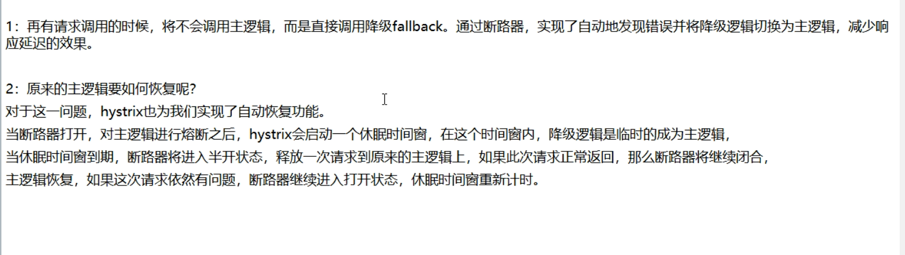

---

## Spring-cloud Gateway

### 是什么

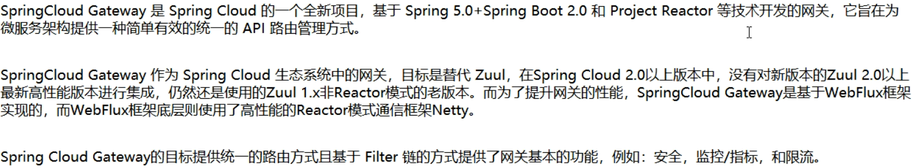

### 能干嘛

反向代理、鉴权、流量控制、熔断、日志监控等

### 三大核心概念

1. Route(路由)：路由是构建网关的基本模块，它由ID，目标URI，一系列的断言和过滤器组成，如果断言为true则匹配该路由。
2. Predicate（断言）：参考的是java8的java.util.function.Predicate开发人员可以匹配HTTP请求中的所有内容（例如请求头或请求参数），如果请求与断言相匹配则进行路由。
3. Filter(过滤)：指的是Spring框架中GatewayFilter的实例，使用过滤器，可以在请求被路由前或者之后对请求进行修改。
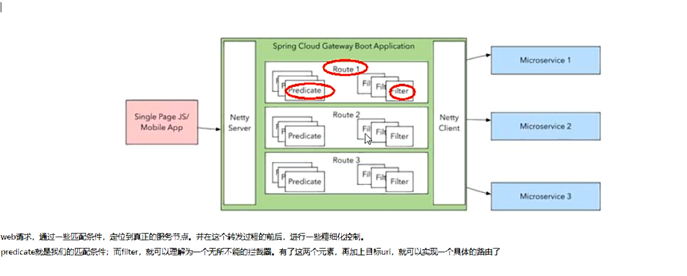


### 工作流程
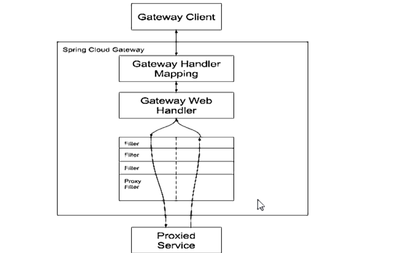
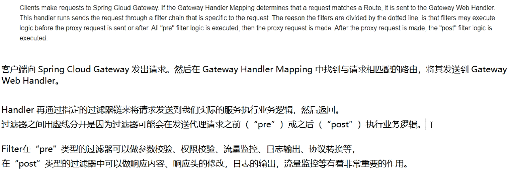

### mavne依赖

```xml
<dependency>
    <groupId>org.springframework.cloud</groupId>
    <artifactId>spring-cloud-starter-gateway</artifactId>
</dependency>
```

### yml配置

```yaml
spring:
  application:
    name: spring-cloud-gateway
  cloud:
    gateway:
      routes:
        - id: payment_routh #路由的ID，没有固定规则但要求唯一，建议配合服务名
          uri: http://localhost:8001 #匹配后提供服务的路由地址
          predicates:
            - Path=/payment/queryById/** #断言,路径相匹配的进行路由
```

### 动态路由

```yaml
spring:
  application:
    name: spring-cloud-gateway
  cloud:
    gateway:
      discovery:
        locator:
          enabled: true #开启从注册中心动态创建路由的功能，利用微服务名进行路由
      routes:
        - id: payment_routh #路由的ID，没有固定规则但要求唯一，建议配合服务名
          #uri: http://localhost:8001 #匹配后提供服务的路由地址
          uri: http://eureka-provider-payment
          predicates:
            - Path=/payment/queryById/** #断言,路径相匹配的进行路由
```

### 常用的Route Predicate
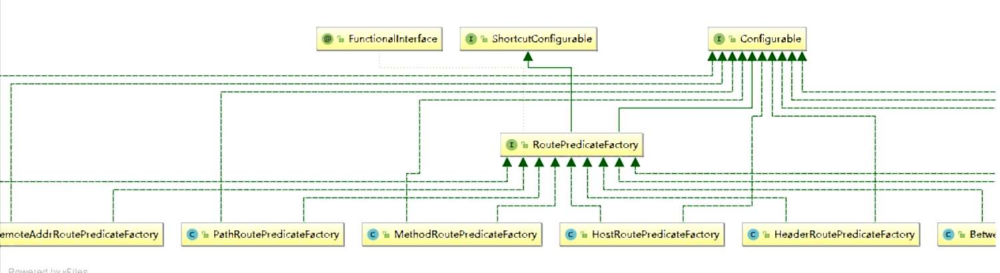

### Filter

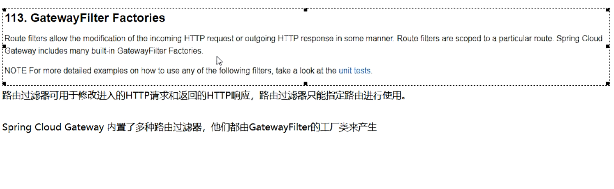

### 自定义过滤器

```java
@Component
@Slf4j
public class MyLogGateWayFilter implements GlobalFilter, Ordered {
    @Override
    public Mono<Void> filter(ServerWebExchange exchange, GatewayFilterChain chain) {

        log.info("*********come in MyLogGateWayFilter: " + new Date());
        String username = exchange.getRequest().getQueryParams().getFirst("username");
        if (StringUtils.isEmpty(username)) {
            log.info("*****用户名为Null 非法用户,(┬＿┬)");
            exchange.getResponse().setStatusCode(HttpStatus.NOT_ACCEPTABLE);//给人家一个回应
            return exchange.getResponse().setComplete();
        }
        return chain.filter(exchange);
    }

    @Override
    public int getOrder() {
        return 0;
    }

}
```

## spring-cloud Stream

### 是什么
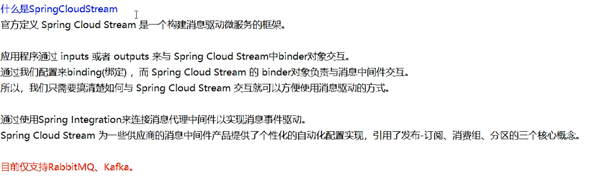

### 为什么用spring-cloud Stream

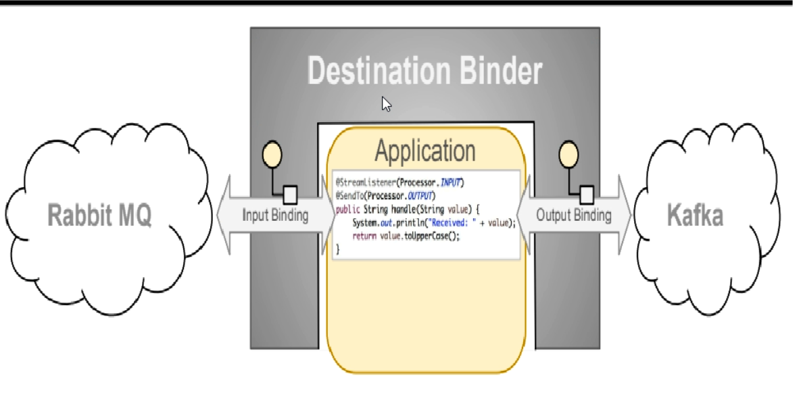

### stream凭什么可以统一底层差异

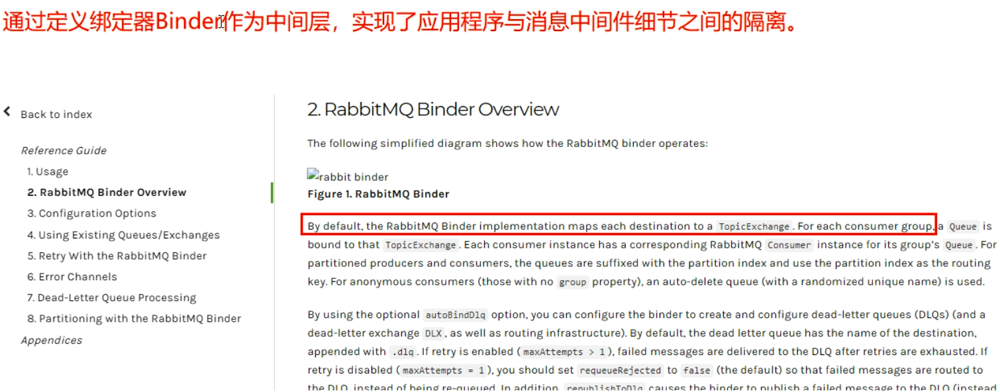

### Binder

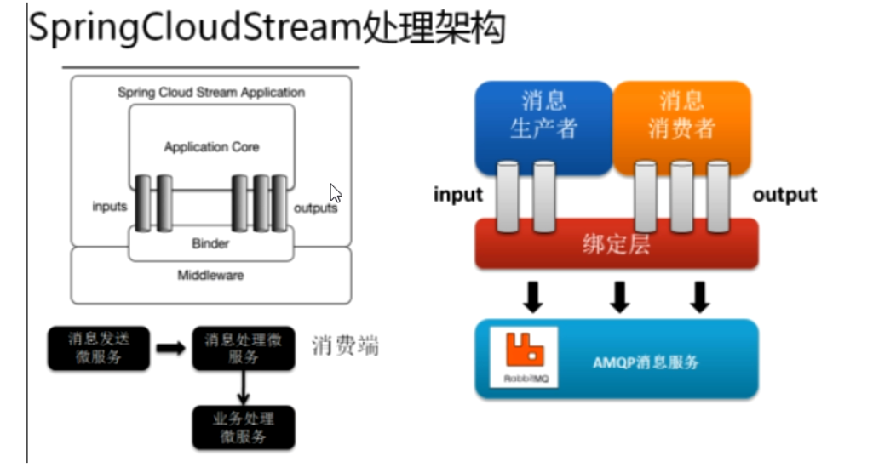

### Spring Cloud Stream标准流程套路
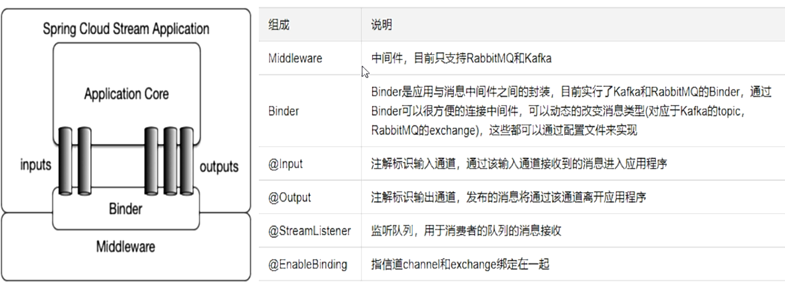


## Spring Cloud Sleuth

### 为什么会出现这个技术？
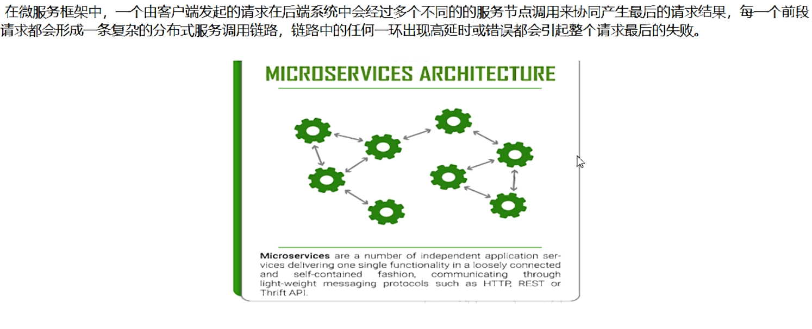

### 是什么

Spring Cloud Sleuth提供了一套完整的服务跟踪的解决方案
在分布式系统中提供追踪解决方案并且兼容支持了zipkin

### 解决
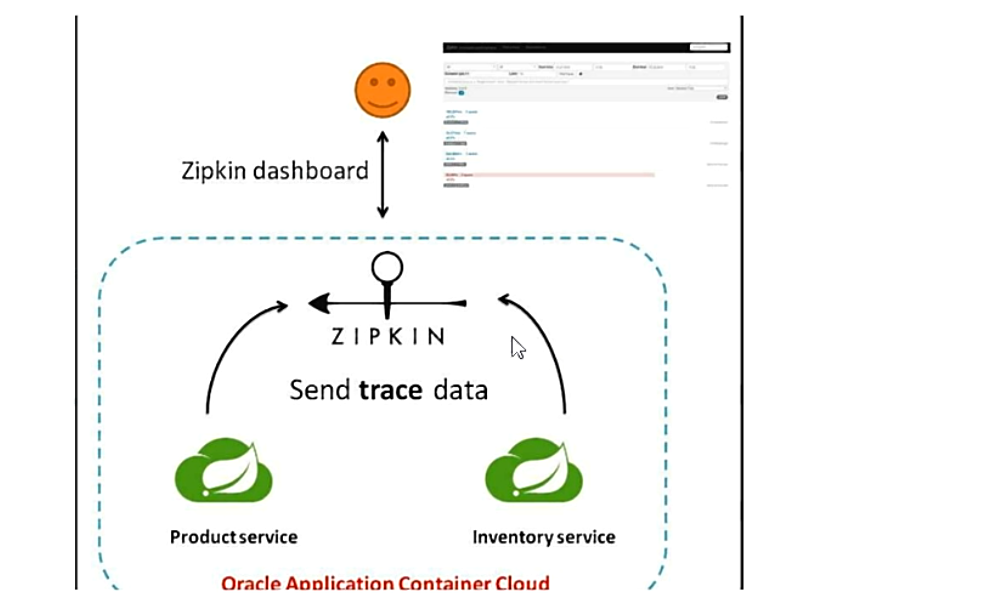

### 完整的调用链路
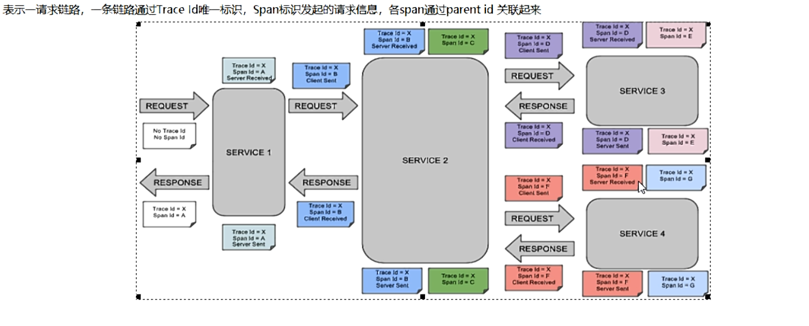

Trace:类似于树结构的Span集合，表示一条调用链路，存在唯一标识

span:表示调用链路来源，通俗的理解span就是一次请求信息

